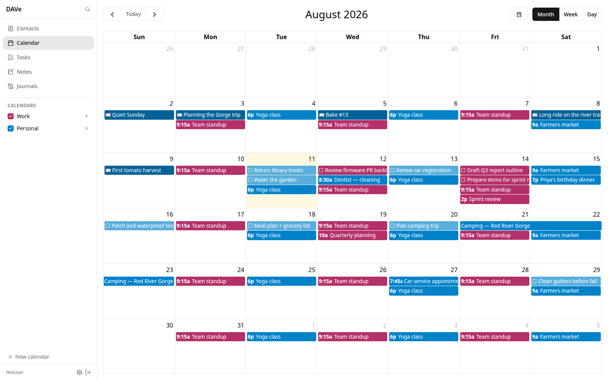

# DAVe — Baikal Web Client

A self-hosted web client for [Baikal](https://sabre.io/baikal/) (CalDAV + CardDAV).

**Stack:** Node 22 · Fastify · React 19 · Vite · Tailwind v4 · TypeScript  
**DAV:** [tsdav](https://github.com/natelindev/tsdav) · [ical.js](https://github.com/kewisch/ical.js)

---


---

## Features

### Contacts
- Alphabetized list with letter groupings, live search, and avatar display
- Full vCard detail view: name, phone, email, address, URL, birthday, anniversary, notes, custom `X-` fields
- Create, edit, and delete with ETag conflict detection
- Photo upload with mandatory crop step, high-quality resize via `pica`, stored as inline base64
- Import `.vcf` files (batch); export all or selected contacts
- Drag-and-drop contacts between address books
- Multi-select with bulk edit and bulk delete
- Merge duplicate contacts
- Per-address-book color customization (stored locally)

### Calendar
- Month, week, and day views via [FullCalendar](https://fullcalendar.io/)
- Create, edit, and delete events
- Recurring events with a full RRULE editor; edit "this / this and following / all instances"
- Drag-to-move and drag-to-resize
- Multiple `VALARM` reminders per event (written as standards-compliant iCal so other clients fire them)
- Timezone handling: events display in browser timezone; the original timezone is shown as a secondary line when it differs
- Calendar color swatches and visibility toggles in the sidebar

### Tasks
- Based on VTODO; requires at least one Baikal collection with VTODO support enabled
- Three layouts: list, compact list, kanban by status
- Subtask support via `RELATED-TO` with indented tree rendering
- Recurring tasks roll forward on completion (advances DTSTART/DUE to next occurrence, resets status — no RECURRENCE-ID overrides)
- Sort by due date, priority, alphabetical, creation/modification date, or category
- Filter by status, category, calendar, due date range, and priority
- Full-text search across summary, description, and categories (debounced, runs against local cache)
- Completed tasks older than `COMPLETED_TASK_RETENTION_DAYS` are evicted from the local cache but remain on Baikal; a "Search Baikal (slower)" toggle in the search bar queries them directly and allows restoring individual tasks
- Multi-select with bulk status, priority, category, calendar, and delete operations

### Notes
- Based on VJOURNAL (without `DTSTART`); requires at least one Baikal collection with VJOURNAL support enabled
- List and grid views with sort, category filters, and full-text search
- Markdown rendering via `react-markdown` + `remark-gfm` (stored as plain text in `DESCRIPTION` for interop)
- Split-pane editor (raw markdown + rendered preview) on desktop; tab-between-panes on mobile
- Multi-select with bulk edit and delete
- "Convert to Journal" button adds `DTSTART` and moves the entry to the Journals tab

### Journals
- Based on VJOURNAL (with `DTSTART`); shares collections with Notes
- Three views: Timeline (reverse-chronological, default), Calendar (month grid, desktop only), and List
- Timeline groups entries by month and day with a date-jump widget
- Calendar view built on FullCalendar's month grid; click an empty day to create a new journal entry
- Full-text search and category filters across all three views
- Multi-select with bulk edit and delete
- "Convert to Note" button removes `DTSTART` and moves the entry to the Notes tab

### Global search
- **Cmd+K** (or **Ctrl+K**) opens a modal that searches across all data types simultaneously
- Tasks, notes, and journals are searched via SQLite FTS against the local cache; calendar events are queried from Baikal (±60 days from today); contacts are searched client-side from the in-memory cache
- Keyboard navigation (↑↓ to move, Enter to open, Esc to close)
- Navigates to the correct tab and selects and scrolls to the item in the list

### General
- Dark mode with system-preference default, toggleable in settings
- Sidebar collection visibility toggles with color swatches
- Mobile-responsive layout; sidebar collapses on small screens
- Optimistic UI for edits with rollback on failure
- Multi-user: each user authenticates with their own Baikal credentials and sees only their own collections

---

## Quick start (development)

You need an existing Baikal instance. Point `DAV_BASE_URL` at its DAV endpoint and make sure **Basic auth is enabled** in Baikal's settings (Settings → WebDAV auth type). tsdav uses Basic auth; leaving it on Digest will cause all logins to fail with 401.

```bash
# 1. Clone and install
git clone <repo> dave && cd dave
npm install

# 2. Configure
cp .env.example .env
# Edit .env — set DAV_BASE_URL, SESSION_SECRET, etc.

# 3. Start dev servers (backend + frontend with hot reload)
npm run dev
# Backend → http://localhost:3000
# Frontend → http://localhost:5173
```

Alternatively, use the dev Docker image (source bind-mounted for hot reload):

```bash
# Edit DAV_BASE_URL in docker-compose.dev.yml, then:
docker compose -f docker-compose.dev.yml up -d
# Backend → http://localhost:3000   Frontend → http://localhost:5173
```

Backend changes restart automatically via `tsx watch`; frontend changes apply instantly via Vite HMR.

### Baikal collection setup for Tasks, Notes, and Journals

Baikal calendar collections default to VEVENT only. To use Tasks, Notes, or Journals you must enable the relevant component types on at least one collection:

1. In the Baikal admin UI, go to **Users → [username] → Calendars**.
2. Edit (or create) a calendar collection and check **VTODO** for tasks, **VJOURNAL** for notes and journals.

DAVe reads the `supported-component-set` from each collection on discovery and shows it only in the appropriate tab(s). No manual URL configuration needed.

---

## Configuration

All configuration is via environment variables. Copy `.env.example` to `.env` and fill in:

| Variable | Required | Default | Description |
|---|---|---|---|
| `DAV_BASE_URL` | Yes | — | Root URL of the Baikal DAV endpoint, e.g. `https://baikal.example.com/dav.php` |
| `SESSION_SECRET` | Yes | — | Random secret ≥ 32 chars for encrypting session credentials. Generate: `openssl rand -hex 32` |
| `SESSION_TTL_HOURS` | No | `168` | Session inactivity timeout in hours (sliding window). Default = 7 days. |
| `PORT` | No | `3000` | Port to listen on |
| `BIND_ADDRESS` | No | `0.0.0.0` | Address to bind |
| `TRUST_PROXY` | No | `0` | Set to `1` when running behind a reverse proxy — enables `Secure` cookies and reads the client IP from `X-Forwarded-For` (used for login rate limiting). A startup warning is logged if this is unset in production. |
| `DATA_DIR` | No | `/data` | Directory for the SQLite session and cache databases |
| `SYNC_INTERVAL_SECONDS` | No | `60` | How often the background worker polls Baikal for changes to tasks, notes, and journals |
| `MAX_CACHED_ENTRIES_PER_USER` | No | `10000` | Safety cap on cached task/note/journal entries per user |
| `COMPLETED_TASK_RETENTION_DAYS` | No | `7` | Days a completed task stays in the local cache after its `COMPLETED` timestamp (1–90). Older completions remain on Baikal and are reachable via "Search Baikal." |
| `DAV_ARCHIVE_SEARCH_MAX_AGE_DAYS` | No | `365` | How far back the "Search Baikal (slower)" task search queries for old completed tasks |
| `EVENT_SEARCH_RANGE_DAYS` | No | `60` | Days in each direction from today that global search queries Baikal for calendar events |
| `CACHE_DB_PATH` | No | `$DATA_DIR/cache.db` | Override path for the sync cache SQLite file |

---

## Production deployment

### Docker Compose

```bash
cp .env.example .env
# Fill in DAV_BASE_URL, SESSION_SECRET, etc.
docker compose up -d
```

The production image is a multi-stage build. Session data and the sync cache are stored in a named Docker volume (`data`) mounted at `/data`. Both persist across container restarts.

The container listens on HTTP only. Terminate TLS at a reverse proxy and set `TRUST_PROXY=1` in `.env`.

### Data at rest

Two things live in the `/data` volume, with deliberately different protection:

- **Baikal credentials** (`sessions.sqlite`) are **encrypted** at the app layer (AES-256-GCM, key derived from `SESSION_SECRET` via HKDF-SHA256 with a per-record salt). This is the high-value secret, so it's never stored in the clear.
- **Cached content** (`cache.db` — your calendar events, contacts, tasks, and notes, including full vCard/iCalendar bodies) is stored **unencrypted**. This is a mirror of data Baikal already holds in plaintext, and it's kept queryable so SQLite FTS5 can power global search. Encrypting it would disable full-text search for little real gain, since the running app needs the key in memory on every request anyway.

If the contents of `/data` are sensitive in your environment, protect them at the deployment layer rather than the app layer: **encrypt the underlying volume/disk** (LUKS, encrypted EBS/PD, etc.) and **encrypt your backups**. Volume encryption transparently covers both SQLite files and keeps search working. Note that if you run DAVe on a different host than Baikal, `cache.db` becomes a second plaintext copy of that data — factor that into where you place the volume.

### Nginx

```nginx
server {
    listen 443 ssl;
    server_name dave.example.com;

    ssl_certificate     /etc/ssl/certs/dave.crt;
    ssl_certificate_key /etc/ssl/private/dave.key;

    location / {
        proxy_pass http://127.0.0.1:3000;
        proxy_set_header Host              $host;
        proxy_set_header X-Real-IP         $remote_addr;
        proxy_set_header X-Forwarded-For   $proxy_add_x_forwarded_for;
        proxy_set_header X-Forwarded-Proto $scheme;
    }
}
```

### Caddy

```caddyfile
dave.example.com {
    reverse_proxy localhost:3000
}
```

Caddy handles TLS automatically.

---

## Common commands

```bash
npm run dev          # Start backend + frontend dev servers
npm run build        # Production build (backend bundle + frontend SPA)
npm test             # Unit tests
npm run test:e2e     # Playwright E2E tests (app must be running)
npm run lint         # ESLint
npm run typecheck    # tsc --noEmit across all packages

docker compose -f docker-compose.dev.yml up -d   # Dev stack with hot reload
docker compose -f docker-compose.dev.yml down -v  # Tear down + remove volumes
```

---

## Testing

### Unit tests

```bash
npm test                        # all unit tests
npm test -w packages/backend    # backend only (vCard, iCal, crypto, routes, sync worker)
npm test -w packages/frontend   # frontend only (API client, hooks)
```

### Integration tests

Integration tests use Fastify's in-process `.inject()` against a real Baikal container. Start the test stack before running:

```bash
docker compose -f docker-compose.test.yml up -d
# baikal-init seeds testuser/testpass automatically; wait for it to exit
npm run test:integration -w packages/backend
```

The test stack runs on port 8801 (distinct from the dev stack).

### E2E tests (Playwright)

```bash
npx playwright install --with-deps   # first run only
npm run dev &                        # app must be running
npm run test:e2e                     # headless
npm run test:e2e:ui                  # interactive UI mode
```

---

## Project structure

```
packages/
  shared/     TypeScript types shared between frontend and backend
  backend/    Fastify server — session management, DAV proxy, sync cache, sync worker
  frontend/   React SPA (Vite + Tailwind)
scripts/
  seed.sh        Populate a dev Baikal with a test user + collections
  seed-test.sh   Seed the integration-test Baikal (testuser/testpass)
Dockerfile         Production multi-stage build
Dockerfile.dev     Development image (source bind-mounted)
docker-compose.yml           Production compose (app only)
docker-compose.dev.yml       Dev compose (app + hot reload)
docker-compose.test.yml      Integration test stack (app + Baikal)
```

### Backend internals

- **Sessions:** server-side in SQLite (`/data/sessions.sqlite`), credentials AES-256-GCM encrypted (HKDF-SHA256 key from `SESSION_SECRET`, per-record salt)
- **Sync cache:** separate SQLite file (`/data/cache.db`) with FTS5 full-text search; stores normalized tasks, notes, and journals for responsive querying. Content is stored unencrypted — see [Data at rest](#data-at-rest)
- **Sync worker:** background process that runs `sync-collection` against each VTODO/VJOURNAL collection every `SYNC_INTERVAL_SECONDS`; writes are immediately reflected in the cache without waiting for the next poll
- **Rate limiting:** login is throttled to 10 attempts / 15 min per IP, with a looser global cap as a backstop; client IPs come from `X-Forwarded-For` only when `TRUST_PROXY=1`

---

## Interoperability

DAVe is tested against Baikal and designed to round-trip cleanly with:

- **DAVx⁵** on Android for CalDAV/CardDAV sync
- **jtx Board** on Android for tasks, notes, and journals (VTODO + VJOURNAL)

Baikal stores vCard 3.0; DAVe reads and writes vCard 3.0 and preserves all unknown properties and parameters on round-trip. Notes and journals are stored as plain text in `DESCRIPTION` (with markdown syntax visible as-is in other clients) so they remain readable outside DAVe.
